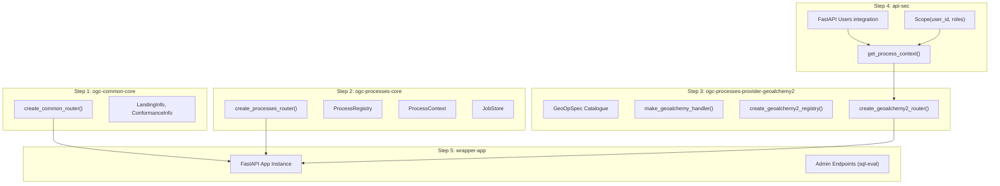
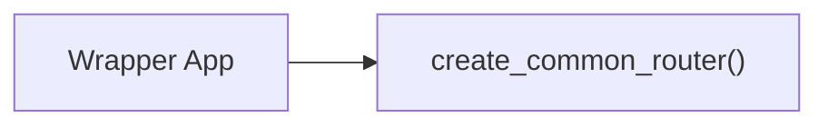
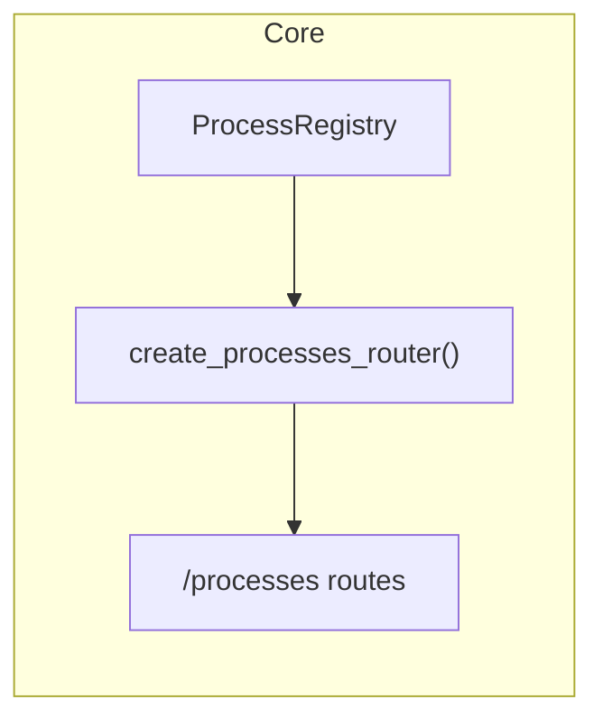
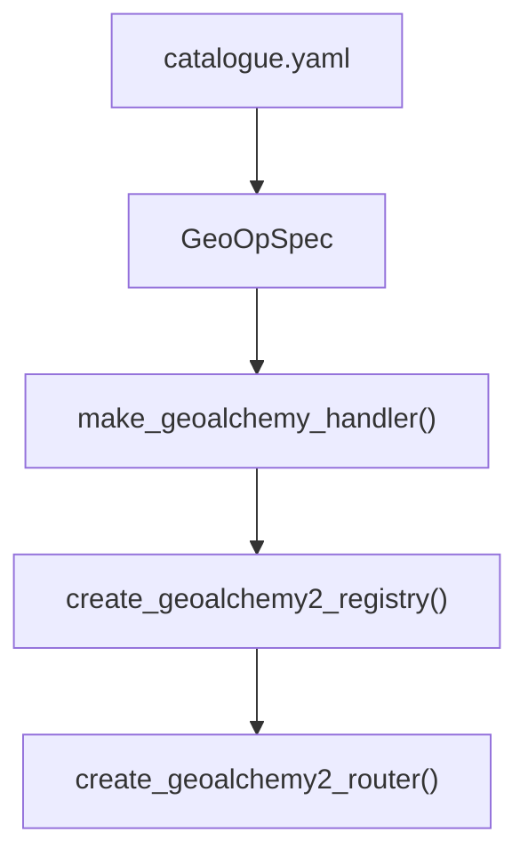
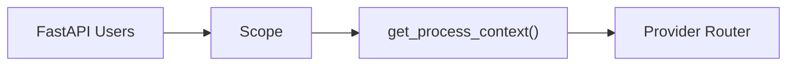
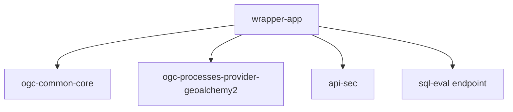
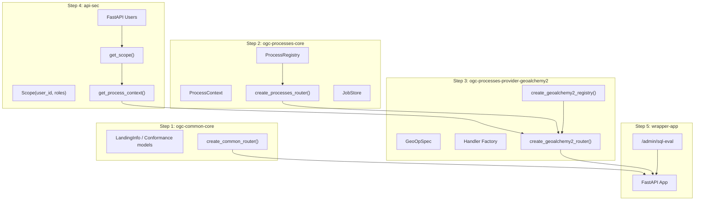

# fastgeoapi
A Python based implementation of the [Open Geospatial Consortium's APIs](https://ogcapi.ogc.org/)  using [FastAPI](https://fastapi.tiangolo.com/), [SQLAlchemy](https://www.sqlalchemy.org/) and [GEOAlchemy2](https://geoalchemy-2.readthedocs.io/).

---

# 🧭 Project Architecture Overview

This project is a modular, incremental implementation of OGC API components, built on FastAPI, with interchangeable providers (e.g., GeoAlchemy2).
Security and data access concerns are handled separately and can evolve over time without rewriting the core functionality.

The system is composed of small, focused repos, each responsible for one concern:

---

## 📦 Repository Map

step 1 → ogc-common-core  
step 2 → ogc-processes-core  
step 3 → ogc-processes-provider-geoalchemy2  
step 4 → api-sec (initially just FastAPI Users wiring)  
step 5 → wrapper-app (your deployable OGC Processes service)  
(step 6+) ogc-features-core, ogc-features-provider-geoalchemy2, etc.

---

## 🗺️ High-Level Architecture (Mermaid)

---

## 🧩 Component Responsibilities

Below is a breakdown of each step / repo, its purpose, and how it integrates with the others.

---

# Step 1 — ogc-common-core

OGC API “Common” building blocks.

Responsibilities:

Landing page model

Conformance declaration model

Router factory for:

/

/conformance

(later) /api or /openapi links

Contains no knowledge of:

Processes

Features

Security

Database

Exposes:

create_common_router(landing, conformance) -> APIRouter

Used by:

Wrapper app (step 5)

---

---

# Step 2 — ogc-processes-core

Backend-agnostic OGC API – Processes engine.

Responsibilities:

Core OGC Processes semantics

Models:

ProcessDescription

InputDescription

OutputDescription

ProcessRegistry

ProcessDefinition

ProcessContext (opaque dict)

Jobs + in-memory JobStore

Router:

/processes

/processes/{id}

/processes/{id}/execution

/processes/jobs/*

Contains no backend logic:

No GeoAlchemy2

No DB

No auth

No request-level security

Used by:

Provider libraries

Wrapper app indirectly (through provider)

---

---

# Step 3 — ogc-processes-provider-geoalchemy2

PostGIS/GeoAlchemy2 provider implementing ~40 curated spatial processes.

Responsibilities:

Static catalogue (catalogue.yaml) of supported ST_* operations

GeoOpSpec → internal operator representation

Handler factory:

literal mode: geometry inputs

table mode: operate on geometry columns in DB

Builds a ProcessRegistry from operator specs

Exposes:

create_geoalchemy2_router(context_dep)

create_geoalchemy2_registry()

re-exports ProcessContext

Does not include:

Auth

Multi-tenancy

Admin SQL breakout
(These live in wrapper)

---

---

# Step 4 — api-sec

Basic auth layer: start simple, grow later.

Responsibilities (v0):

Integrates FastAPI Users:

user registration

JWT auth

basic roles

Scope abstraction:

Scope(user_id, roles)

get_scope() dependency

get_process_context():

builds ProcessContext for processes

injects { "db": session, "scope": scope, "layers": ... }

Does not (yet) implement:

Multi-tenant RLS

External PDP (OPA/Cerbos/OSO)

Complex ACLs

Policy engine

This keeps everything sane for a solo dev.

---

---

# Step 5 — wrapper-app

A deployable OGC API – Processes server.

Responsibilities:

Instantiate FastAPI app

Mount:

common router (/, /conformance)

processes router from GeoAlchemy2 provider

auth routes

admin routes (/admin/sql-eval)

Compose:

DB session factory

scope

security

provider context

Includes:

Optional superuser SQL breakout endpoint
(POST /admin/sql-eval)
for power users to run any PostGIS query.

---

---

# (Step 6+) Future Components

You can extend the architecture the same way:

ogc-features-core

ogc-features-provider-geoalchemy2

ogc-tiles-core

ogc-coverages-core

ogc-edr-core

etc.

Each with:

core module (OGC specs)

provider module (implementation)

wrapper app composes them

Same pattern, endlessly reusable.

---

# 📚 How Everything Fits Together (Full Mermaid)

---

# 🧱 Summary

This design gives you:

Clean separation of concerns

Reusable components

Provider-based backend logic

Minimal security layer with room to grow

A safe “escape hatch” (sql-eval) for power users

OGC Processes compliance without tying your hands

An architecture that can scale into Features, Tiles, Coverages, etc.